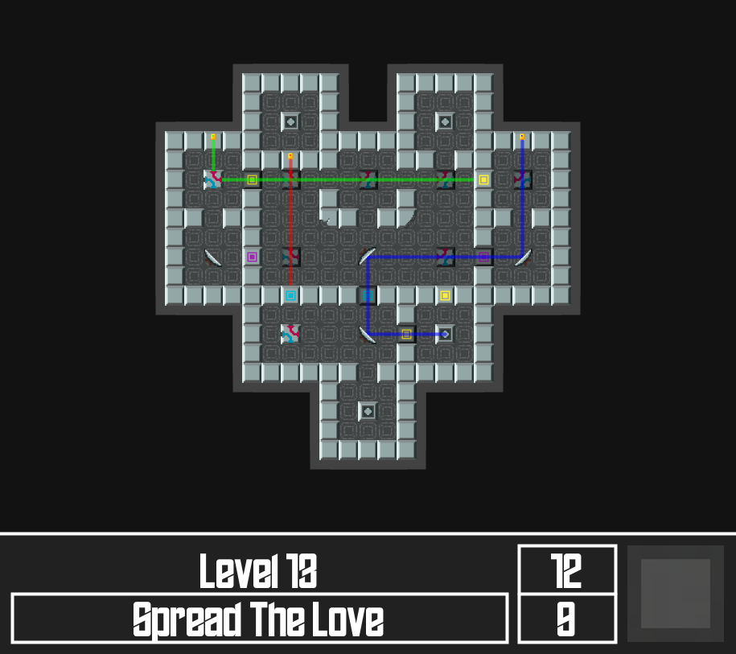

# Laser Temple (PiS, SoSe 2021)

> Autor: Hendrik Wagner, 5328402

## Kurzbeschreibung der Anwendung

*Laser Temple* ist ein Puzzlespiel, indem der/die Spieler:in versuchen muss, einen oder mehrere Laser zu Zielblöcken zu
leiten. Dabei können Laserstrahlen mithilfe von Spiegeln, Tunneln, Schaltern und anderen Elementen beeinflusst und
umgelenkt werden. Ein Level gilt als gewonnen, wenn alle Laser an einem solchen Zielblock enden.

Der/die Spieler:in kann mit der Maus auf Elemente klicken und sie so ggf. beeinflussen. Einige Elemente werden durch
Laser beeinflusst, welche auf ein Zielblock treffen. Andere Elemente sind fest verankert und müssen mit eingeplant
werden, um das Puzzle zu lösen.

Die Reihenfolge der Level ist so gestaltet, dass Spieler:innen die verschiedenen Elemente kennenlernen und
nachvollziehen können. Entsprechend der Anzahl von benötigten Bewegungsschritten wird dem/der Spieler:in eine Medaille
verliehen (unten rechts). Nur die bestmögliche Anzahl von Bewegungsschritten resultiert in eine Goldmedaille.
*(118 Wörter)*

## Screenshot



## Bedienungshinweise

Das Spiel wird überwiegend mit der Maus gespielt. Dabei ändert sich der Cursor entsprechend, wenn er über einem Element
liegt, mit welchem interagiert werden kann.

Für den Fall, dass sich das Element rotieren kann, dreht sich das Element immer in die Richtung, die dem gedrückten
Maus-Button entspricht (linker Maus-Button = Element rotiert nach links). Dies ist besonders relevant, wenn die
Goldmedaille erzielt werden soll.

Links neben der derzeitigen Medaille wird die derzeitigen Bewegungsschritte über der bestmöglichen Anzahl von Schritten
angezeigt.

Mit Schaltern, die den Farben Cyan, Gelb und Magenta entsprechen, kann mit der Maus interagiert werden. Schalter, wessen
Farbe der eines Lasers entspricht, werden aktiviert, sobald ein Laser dieser Farbe auf einen Zielblock trifft.

Levels können jederzeit mit den Pfeil-Buttons der Tastatur gewechselt werden. Dabei agieren die Knöpfe `UP` und `DOWN`
als "Neu Starten", und `LEFT` und `RIGHT` als vorheriges bzw. nächstes Level.

> Das Fenster ist dynamisch und kann in der Größe angepasst werden.
> Dabei können sehr kleine Fenstergrößen (kleiner als 500 x 500) dazu führen, dass das Spiel nicht gut spielbar ist.
> Ebenso können sehr größe Fenster (größer als 1500 x 1500), abhängig von verfügbarer Rechenleistung, zu Framerate-Einbrüchen führen.

## Übersicht Dateien und LOC

```
\gradlew
\gradlew.bat
\README.md
\settings.gradle
\app\build.gradle
\app\core.jar
\app\src\main\java\engine\Engine.java
\app\src\main\java\engine\GameEngine.java
\app\src\main\java\engine\Laser.java
\app\src\main\java\engine\Level.java
\app\src\main\java\engine\package-info.java
\app\src\main\java\engine\Pair.java
\app\src\main\java\engine\Tile.java
\app\src\main\java\main\App.java
\app\src\main\java\main\BoardManager.java
\app\src\main\java\main\Image.java
\app\src\main\java\main\package-info.java
\app\src\main\resources\EdgeOfTheGalaxy.otf
\app\src\main\resources\levels.json
\app\src\main\resources\img\bronze.png
\app\src\main\resources\img\double_mirror_left.png
\app\src\main\resources\img\double_mirror_left_grounded.png
\app\src\main\resources\img\double_mirror_right.png
\app\src\main\resources\img\double_mirror_right_grounded.png
\app\src\main\resources\img\floor_0.png
\app\src\main\resources\img\floor_180.png
\app\src\main\resources\img\floor_270.png
\app\src\main\resources\img\floor_90.png
\app\src\main\resources\img\floor_blue.png
\app\src\main\resources\img\floor_cyan.png
\app\src\main\resources\img\floor_green.png
\app\src\main\resources\img\floor_magenta.png
\app\src\main\resources\img\floor_red.png
\app\src\main\resources\img\floor_yellow.png
\app\src\main\resources\img\gold.png
\app\src\main\resources\img\laser_blue_0.png
\app\src\main\resources\img\laser_blue_180.png
\app\src\main\resources\img\laser_blue_270.png
\app\src\main\resources\img\laser_blue_90.png
\app\src\main\resources\img\laser_green_0.png
\app\src\main\resources\img\laser_green_180.png
\app\src\main\resources\img\laser_green_270.png
\app\src\main\resources\img\laser_green_90.png
\app\src\main\resources\img\laser_red_0.png
\app\src\main\resources\img\laser_red_180.png
\app\src\main\resources\img\laser_red_270.png
\app\src\main\resources\img\laser_red_90.png
\app\src\main\resources\img\mirror_0.png
\app\src\main\resources\img\mirror_180.png
\app\src\main\resources\img\mirror_270.png
\app\src\main\resources\img\mirror_90.png
\app\src\main\resources\img\none.png
\app\src\main\resources\img\null.png
\app\src\main\resources\img\redirect_left.png
\app\src\main\resources\img\redirect_right.png
\app\src\main\resources\img\rubble_0.png
\app\src\main\resources\img\rubble_180.png
\app\src\main\resources\img\rubble_270.png
\app\src\main\resources\img\rubble_90.png
\app\src\main\resources\img\silver.png
\app\src\main\resources\img\stone_blue.png
\app\src\main\resources\img\stone_broken1_0.png
\app\src\main\resources\img\stone_broken1_180.png
\app\src\main\resources\img\stone_broken1_270.png
\app\src\main\resources\img\stone_broken1_90.png
\app\src\main\resources\img\stone_chipped_0.png
\app\src\main\resources\img\stone_chipped_180.png
\app\src\main\resources\img\stone_chipped_270.png
\app\src\main\resources\img\stone_chipped_90.png
\app\src\main\resources\img\stone_clean.png
\app\src\main\resources\img\stone_cyan.png
\app\src\main\resources\img\stone_green.png
\app\src\main\resources\img\stone_laser.png
\app\src\main\resources\img\stone_magenta.png
\app\src\main\resources\img\stone_red.png
\app\src\main\resources\img\stone_target.png
\app\src\main\resources\img\stone_yellow.png
\app\src\test\java\engine\GameEngineTest.java
\app\src\test\java\engine\LaserTest.java
\app\src\test\java\engine\LevelTest.java
\app\src\test\java\engine\PairTest.java
\app\src\test\java\engine\TileTest.java
\app\src\test\java\engine\TileTypeTest.java
\gradle\wrapper\gradle-wrapper.jar
\gradle\wrapper\gradle-wrapper.properties
```

### LOC des `app/src/main/` Verzeichnis

```
-------------------------------------------------------------------------------
Language                     files          blank        comment           code
-------------------------------------------------------------------------------
JSON                             1              0              0          20870
Java                            11            220            787            638
-------------------------------------------------------------------------------
SUM:                            12            220            787          21508
-------------------------------------------------------------------------------

```

### LOC des `app` Verzeichnis

```
-------------------------------------------------------------------------------
Language                     files          blank        comment           code
-------------------------------------------------------------------------------
JSON                             1              0              0          20870
Java                            17            381            820           1132
HTML                             8              0              0           1082
CSS                              2             49              0            214
JavaScript                       1             45              1            148
XML                              6              0              0             76
Gradle                           1             10             14             26
-------------------------------------------------------------------------------
SUM:                            36            485            835          23548
-------------------------------------------------------------------------------

```

## Quellen

* [Processing Reference](https://processing.org/reference/) ²
* [Processing Javadocs (for advanced features like resizable windows)](https://processing.github.io/processing-javadocs/core/)
  ²
* [JUnit 5 Documentation](https://junit.org/junit5/docs/current/user-guide/) ³
* [OpenProcessing (strictly used for inspiration before deciding on a project, no single idea was taken from there)](https://openprocessing.org/)
  ²
* [Pixilart - Tool used to create all graphics](https://www.pixilart.com/) ²
* [FontSpace: Edge Of The Galaxy Font (public domain, by QD Fonts)](https://www.fontspace.com/edge-of-the-galaxy-font-f45748)
  ²
* [OpenJDK: About Records, an OpenJDK 16 feature (used for classes Laser, Pair and Level)](https://openjdk.java.net/jeps/395)
  ²
* [StackOverflow: Public / Protected / Private](https://stackoverflow.com/questions/215497/what-is-the-difference-between-public-protected-package-private-and-private-in)
  ²
* [StackExchange Mathematics: Shortest direction to rotation target (used for mirror animations)](https://math.stackexchange.com/questions/1366869/calculating-rotation-direction-between-two-angles)
  ²
* [StackOverflow: Using tuples in Java (this inspired the Pair class)](https://stackoverflow.com/questions/2670982/using-pairs-or-2-tuples-in-java)
  ²
* [StackOverflow: Java collection of value pairs / tuples?](https://stackoverflow.com/questions/521171/a-java-collection-of-value-pairs-tuples)
  ²
* [StackOverflow: Iterating over two items of a Stream at once (I asked this question - so don't worry if you see very similar code in the drawLaser method)](https://stackoverflow.com/questions/67643914/how-can-i-iterate-over-two-items-of-a-stream-at-once)
  ²

² Zuletzt am 22.06.2021 abgerufen  
³ Zuletzt am 25.06.2021 abgerufen

... zudem wurden die Inhalte der Vorlesungen PiS und OOP verwendet, besonders für Streams.

> Für das Erstellen von Levels wurde ein zusätzlicher Level-Editor entwickelt.
> Dieser Editor könnte problemlos in die Hauptanwendung integriert werden, ist derzeit (zur Abgabe) aus Platzgründen aber ein separates Projekt.

# Eigenständigkeitserklärung

Hiermit bestätige ich, dass ich die vorgelegte Projektarbeit eigenständig und ohne fremde Hilfe erstellt habe. Ich
erkläre explizit, dass ich kein Plagiat begangen habe, d.h. dass ich keinen Code/Text aus nicht dokumentierten Quellen
verwendet habe und dass nicht umfängliche Teile des Codes (>= 20%) eine “Kopierleistung” sind. Quellen, die ich benutzt
habe, sind vollständig in der Dokumentation angegeben. Ich bestätige außerdem, dass die Projektarbeit nicht vor dem SoSe
2021 entstanden ist und noch nirgends als Prüfungs- oder Zulassungsleistung (wie z.B. zur Klausurzulassung) vorgelegt
worden ist. Mir ist klar, dass die abgegebene Prüfungsleistung für PiS annulliert wird, sollte ich keine Zulassung für
PiS besitzen.